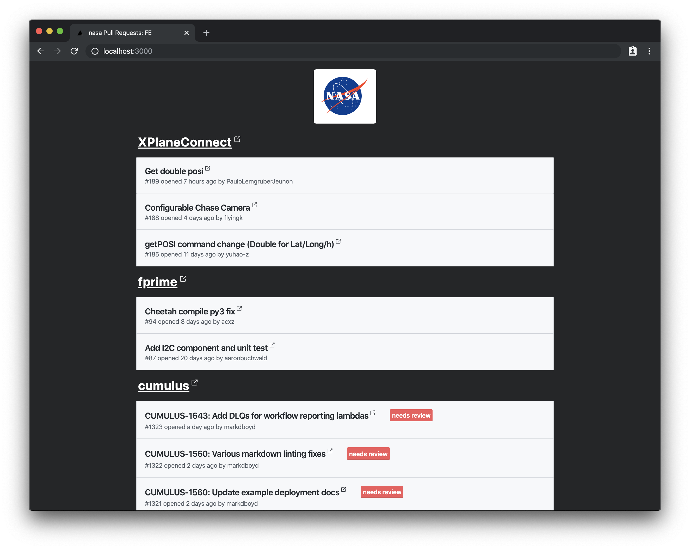

# Github Open PRs

> Simple Page to keep tracking all open PRs from your repos

## Getting Started

This project uses Github GraphQL API. Differently from rest api, it _requires_ you being Authenticated.

So, first step is create a simple token to which can read your repo data ([check it here](https://help.github.com/en/github/authenticating-to-github/creating-a-personal-access-token-for-the-command-line)).

Then, clone this repo and create a `.env` file with your token:

```env
GITHUB_TOKEN=<token-here>
```

The query are made for organization. If that's the case for your, open the file `open-pr-config.js` and provide:

- organizationName: organization user name, for instance on `https://github.com/nasa`, `nasa` should be the name
- repositoriesToList: a list of repositories you want to get PRs. For instance, on `https://github.com/nasa/XPlaneConnect`, `XPlaneConnect` will be the name
- logoUrl: a org logo url

In the end your config will look like:

```js
module.exports = {
  organizationName: "nasa",
  repositoriesToList: ["XPlaneConnect", "fprime", "cumulus"],
  logoUrl:
    "https://upload.wikimedia.org/wikipedia/commons/thumb/e/e5/NASA_logo.svg/1200px-NASA_logo.svg.png"
};
```

And it'll look like:



## Limitations

Github stablish some limits to the amount of PRs and labels you can get at once (100). So if it's more then that, it won't show.
