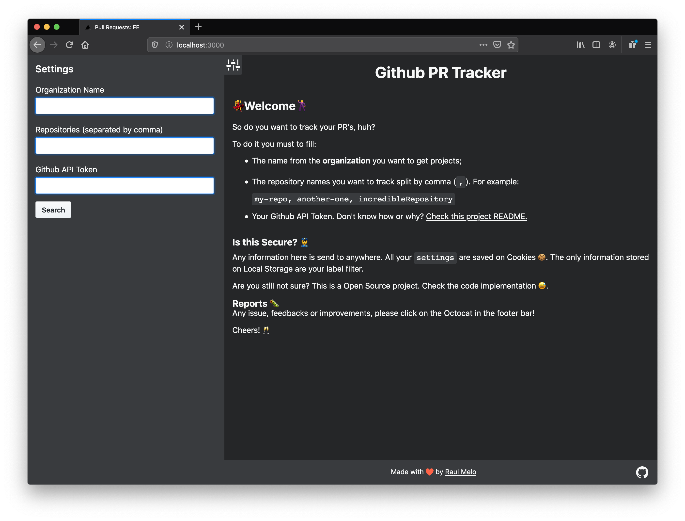

# Github Open PRs

> Simple Page to track open PR's for specifics projects.



## Before start

This project uses [Github GraphQL API](https://developer.github.com/v4/). Differently from their [REST API](https://developer.github.com/v3/), it **requires** you being Authenticated.

### Generating a Token

In their documentation, they said you need the same kind of token as required for CLI's ([check it here](https://developer.github.com/v4/guides/forming-calls/#authenticating-with-graphql)).

However, I would say, you get the follow permissions:

```
[x] repo (you need all in order to handle private proj.)
  [x] repo:status
  [x] repo:status
  [x] repo_deployment
  [x] public_repo
  [x] repo:invite
...

[x] admin:org
  [ ] write:org
  [x] read:org
...
```

Why? Just because this app does not need any right to **write** things, only read organization repositories.

## How to use

### Track your Repos

Basically you need to fill:

- Organization name;
- Repositories name split by comma;
- Github Token API

Then press search and everything will load :)


All your settings will be saved via Cookies since the Token (and maybe your repository names) are a sensitive information.

### Filter by label

To only see specific label, you just need to click in the ones you don't have to see.


In order to keep the selection even if you close the App, this filter is saved via `localStorage`:

```text
key: `pr_tracker_label_by_repo`
value: { <repoId>: <labelId>[] }
```

### Cleaning up

If you want to remove all your data, it's only about:

1. open the app
1. Open your console
1. Application
1. Clear Site Data (must be localStorage and Cookies)

## Development

The same as any modern JS app:

1. Fork/clone this project;
1. navigate inside the folder;
1. run `pnpm` to install dependencies;
1. then boot the server by running `pnpm run dev`

Then your app will be available at `http://localhost:3000`

## Stack

- NextJS
- TypeScript
- ApolloClient
- Styled Components

## Issues

Maybe this is just the beginning. Feel free to report issues, come up with suggestions or improvements. PR's are always open! :)

## License

[MIT](./LICENSE.md)
